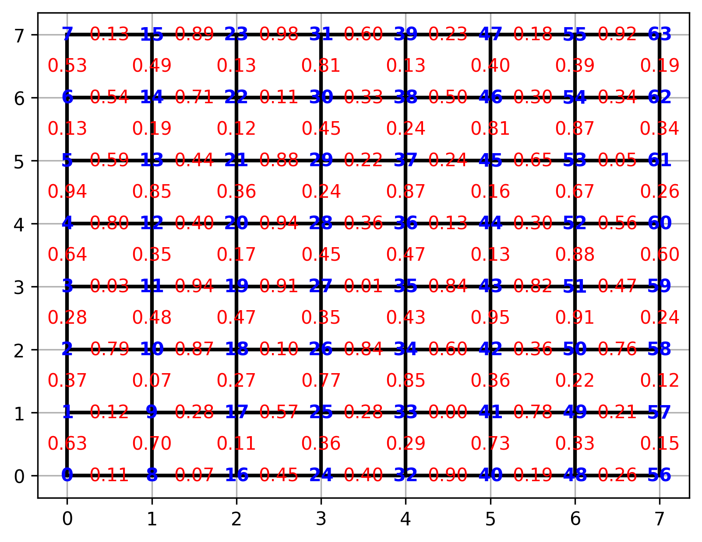
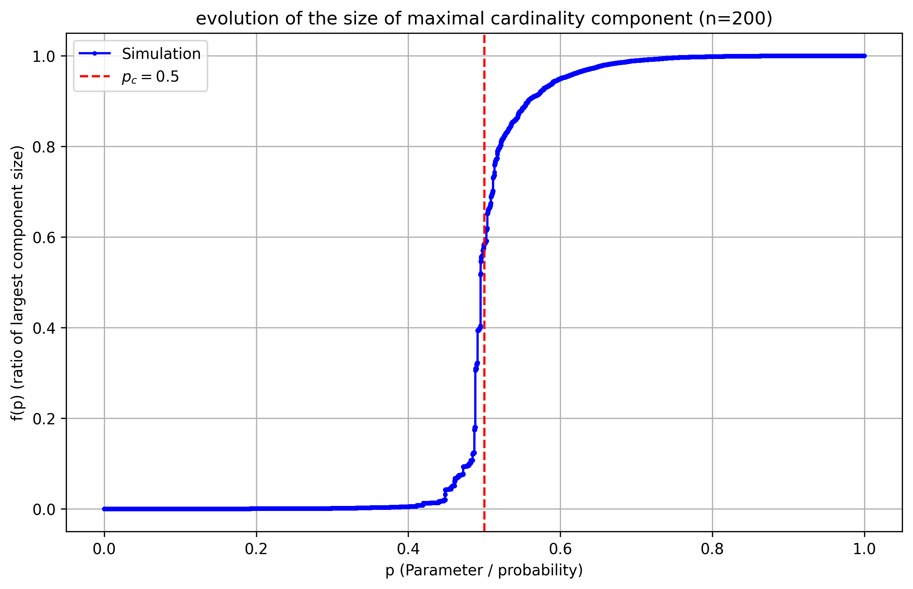

# Percolation
Overview

This project implements a simulation of Bond Percolation on finite square lattices. 

Each edge of the lattice is assigned an independent random paramater $e_p$ uniformly distributed on $(0,1)$. For a given percolation parameter $p$, we draw the edge if $e_p \leq p$. 

Our goal is to track the size of the largest connected component as p increases from 0 to 1. 

# Motivation

Let $G = (V,E)$ be a graph. For each $e \in E$ generate $e_p ~ U(0,1)$. For $p \in [0,1]$ parameter $E_p := \{ e \in E : e_p \leq p \}$

The result graph is $G(p) = (V,E_p)$ is a realization of Bond percolation. 

Let us consider the special case, when the grid is infinte, namely $\mathbb{Z}^2$. The initial quesiton of the problem, is for which critical value of p will there be a connected component with infinite cardinality. (In further readings it is called an open-cluster). 

Theorem (Harris-Kesten). Let $p_H$ denote the critical value for p, then $p_H = 0.5$.

For further reading see https://arxiv.org/abs/math/0410359

# Approach
Let $f(p) = \frac{C_{max}(p)}{|V|}$ where $C_{max}(p)$ is the size of the largest connected component. In the simulation the user can give the size of the grid 
(where n is the number of vertices on the side of the grid) and after simulation the $f(p)$ function is plotted. We shall see that in the finite case at $p=0.5$ 
the function - nearly "jumps" to 1 - increases very sharply. It is an indicator of the theorem, namely if we increase the size of the grid we shall see faster 
increase at the value of 0.5. 

# Example grid
The figure below shows a randomly generated $8 \times 8$ lattice with assigned edge parameters.

# Percolation curve
The figure below shows the curve of of a simulation on a randomly generated $200 \times 200$ lattice.

# Project structure
src/

graph.py # lattice generation

unionfind.py # Union-Find data structure

percolation.py # percolation simulation

plotting.py # visualization

tests/

test_graph.py

notebooks/

example.ipynb

# Installation
Clone the repository and install dependencies:

git clone https://github.com/kalteee/Percolation.git

cd percolation

pip install -r requirements.txt

# Running a simulation
Run a full simulation and visualize the percolation transition:

python run_experiment.py

You can change the grid size:

python run_experiment.py --n 200

To generate an example lattice visualization:

python plot_grid.py

You can change the grid size:

python plot_grid.py --n 8

# Running tests
You can test wether the number of edges are correct, and whether there are any duplicates for a given n:

pytest test/test_graph.py --n 60

# Implementation details

The non-trivial part of the implementation is the use of the Union-Find data structure. 

Edges are processed in increasing order of their assigned random parameters. This realizes the entire coupled percolation process in a single pass through the edge set. This decreases the time complexity of the simulation. 

The largest component size is maintained dynamically during the Union-Find operations.

